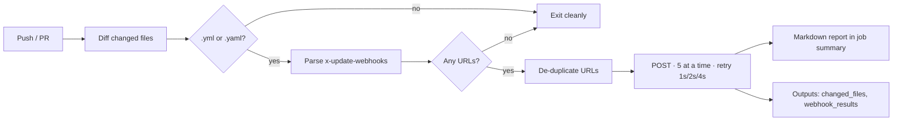

# YML Change Webhook

### Your config files, finally allowed to speak for themselves.

Drop a `x-update-webhooks:` list inside any `.yml` file. The moment that file changes, this Action tells the outside world — no bespoke CI glue, no forgotten notification step, no "who was supposed to redeploy the docs?"

[](https://github.com/marketplace/actions/yml-change-webhook)
[](https://github.com/wearemiew/yml-change-webhook-trigger/releases)
[](https://github.com/wearemiew/yml-change-webhook-trigger/actions/workflows/test.yml)
[](https://nodejs.org)
[](LICENSE.md)

---

## Why this exists

Configuration lives in YAML. The systems that *care* about that configuration live somewhere else — a docs builder, a cache, a Slack channel, a service that needs to reload.

The usual fix is a workflow step per consumer, hand-maintained, drifting quietly out of date until someone notices the docs are three weeks stale.

This Action inverts it. **The file declares its own subscribers.** Whoever owns the YAML owns the notification list, right there in the file they're already editing. CI just reads it and delivers.

```diff
  service: api-gateway
  timeout: 30

+ x-update-webhooks:
+   - https://docs.example.com/api/rebuild
+   - https://deploy.example.com/reload-config
```

That's the whole contract.

## Quickstart

```yaml
name: YML Change Notification

on:
  push:
    paths: ["**.yml", "**.yaml"]
  pull_request:
    paths: ["**.yml", "**.yaml"]

jobs:
  notify-changes:
    runs-on: ubuntu-latest
    steps:
      - uses: actions/checkout@v7.0.1
        with:
          fetch-depth: 0 # required — the Action diffs against history

      - name: Detect YML Changes & Trigger Webhooks
        uses: wearemiew/yml-change-webhook-trigger@v1
        with:
          # Optional: base branch to diff against (handy in PRs)
          base_ref: ${{ github.event.pull_request.base.ref }}
```

> **`fetch-depth: 0` is not optional.** Without full history, `git diff` has nothing to compare against and the Action will find zero changed files.

### Version pinning

| Reference   | Resolves to                        |
| ----------- | ---------------------------------- |
| `@v1`       | latest `v1.x.x` — recommended      |
| `@v1.9`     | latest `v1.9.x`                    |
| `@v1.9.6`   | that exact release, frozen         |

## How it works



1. **Detect** — `git diff` scoped to the event. Pull requests diff against `origin/<base_ref>...HEAD`; pushes use the real commit range from the event payload, with sane fallbacks all the way down to a repo's very first commit.
2. **Parse** — each changed file is loaded with `js-yaml` and read for a top-level `x-update-webhooks` array. Entries must be strings starting with `http`.
3. **Deliver** — URLs are de-duplicated (first file wins for reporting), then POSTed five at a time with a 10s timeout and exponential-backoff retries.
4. **Report** — a Markdown table lands in the workflow summary; machine-readable results land in the Action outputs.

Nothing throws. A malformed file, an unreachable endpoint, or zero matches degrade into warnings and a clean exit — a broken webhook never takes your pipeline down with it.

## The payload

Every subscriber receives a `POST` with `Content-Type: application/json` and `User-Agent: YML-Change-Webhook-Action`:

```json
{
  "source": "yml-change-webhook",
  "file": "config/api.yml",
  "repository": "wearemiew/your-repo",
  "ref": "refs/heads/main",
  "sha": "9f2c1ab…",
  "timestamp": "2026-07-27T12:30:45.123Z"
}
```

Enough to answer *what changed, where, and when* — and to go fetch the rest yourself if you need it.

## Inputs

| Input      | Description                                          | Required | Default |
| ---------- | ---------------------------------------------------- | -------- | ------- |
| `base_ref` | Base reference for comparison (useful in PR scenarios) | No       | `''`    |

## Outputs

| Output            | Description                                                  |
| ----------------- | ------------------------------------------------------------ |
| `changed_files`   | JSON array of the `.yml` / `.yaml` files that changed          |
| `webhook_results` | JSON array of results — masked URL, source file, status, duration, timestamp |

Chain them into whatever comes next:

```yaml
- id: webhooks
  uses: wearemiew/yml-change-webhook-trigger@v1

- name: Announce in Slack
  if: steps.webhooks.outputs.changed_files != '[]'
  run: echo "Changed → ${{ steps.webhooks.outputs.changed_files }}"
```

## Built-in reporting

Every run writes a summary straight into the GitHub Actions job page — no digging through logs:

```markdown
# Webhook Trigger Summary

Total changed files: 2

## Files Changed

| File                       | Webhook Count | Success Rate |
| -------------------------- | ------------- | ------------ |
| config/api.yml             | 1             | 100%         |
| settings/notifications.yml | 2             | 50%          |

## Webhook Executions

| File                       | Webhook                      | Status     | Duration | Timestamp |
| -------------------------- | ---------------------------- | ---------- | -------- | --------- |
| config/api.yml             | https://example.com/web...k1 | ✅ success | 340ms    | 12:30:45  |
| settings/notifications.yml | https://example.com/web...k2 | ✅ success | 220ms    | 12:30:46  |
| settings/notifications.yml | https://example.com/web...k3 | ❌ failed  | 10004ms  | 12:30:57  |

## Overall Statistics

- **Total Webhooks:** 3
- **Successful:** 2
- **Failed:** 1
- **Success Rate:** 67%
```

## Reliability & security

| Concern            | How it's handled                                                                 |
| ------------------ | -------------------------------------------------------------------------------- |
| Flaky endpoints    | Up to 4 attempts per URL — initial call plus retries at 1s, 2s and 4s              |
| Slow endpoints     | 10-second timeout per request                                                     |
| Many endpoints     | Bounded concurrency — 5 requests in flight at a time                              |
| Duplicate URLs     | De-duplicated across all changed files before any request goes out                |
| Tokens in URLs     | Every URL is host + truncated-path masked **before** it touches a log or an output |
| Anything unexpected | Reported through `core.warning` / `core.setFailed` — the job never crashes on you |

Webhook URLs frequently carry secrets in the path or query string. This Action assumes yours do: nothing is ever printed or exported in full. Even so, prefer endpoints that authenticate the *payload*, not the URL.

## Good fits

- **Docs that rebuild themselves** — edit the spec, the site regenerates.
- **Config reloads** — a service picks up its new settings without a deploy.
- **Cache invalidation** — the CDN hears about it the moment the file lands.
- **Infrastructure as Code** — notify the tools that track your definitions.
- **Cross-repo choreography** — one repo's YAML nudges another repo's pipeline.

Working examples live in [`examples/`](examples/).

## Development

Requires **Node.js 24+**.

```bash
git clone https://github.com/wearemiew/yml-change-webhook-trigger.git
cd yml-change-webhook-trigger
npm install

npm test          # Jest suite
npm run lint      # eslint
npm run format    # prettier
npm run build     # ncc bundle → dist/
```

`dist/` is git-ignored on purpose. It's a build artifact, committed only by the release workflow — never add it to a PR by hand.

Commits follow [Conventional Commits](https://www.conventionalcommits.org/); the version bump is derived from them automatically (`fix:` → patch, `feat:` → minor, `feat!:` / `BREAKING CHANGE:` → major). Releases, floating `vN` / `vN.M` tags and the Marketplace listing are all handled by chained workflows — the full picture is in [docs/workflows.md](docs/workflows.md).

## Contributing

Issues and pull requests are genuinely welcome. Start with [CONTRIBUTING.md](CONTRIBUTING.md).

## License

Released under the [MIT License](LICENSE.md). Copyright © 2025-2026 [MIEW](https://miew.io).

---

<div align="center">

**Made with [Claude](https://claude.ai) and explorer spirit.** 🧭

Built by [MIEW](https://miew.io) — a digital product studio.
We build the future, one commit at a time.

[Website](https://miew.io) · [Substack](https://miewproduct.substack.com/) · [LinkedIn](https://www.linkedin.com/company/miew/) · [Instagram](https://www.instagram.com/wearemiew/) · [Dribbble](https://dribbble.com/wearemiew) · [Behance](https://www.behance.net/miew)

</div>
